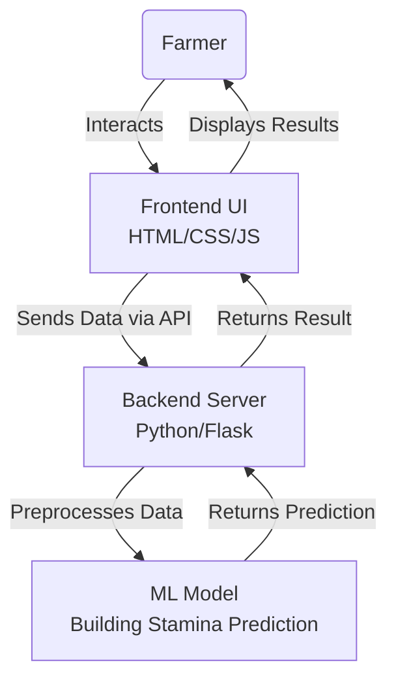

# System Design & Architecture

## 1. System Architecture Diagram

The system follows a standard 3-tier architecture with an integrated Machine Learning component.

## 2. Technology Stack Finalization

### Frontend
- **Languages:** HTML5, CSS3, JavaScript (ES6+)
- **Styling:** Vanilla CSS (Modern features: Flexbox, Grid, CSS Variables)
- **Design:** Respondent, Mobile-Friendly (Glassmorphism aesthetics)

### Backend
- **Language:** Python 3.x
- **Framework:** Flask (Lightweight, optimal for ML integration)
- **API:** RESTful API endpoints

### Machine Learning
- **Libraries:** Scikit-learn, Pandas, NumPy
- **Model Type:** Regression/Classification (depending on exact Stamina metric)
- **Data handling:** CSV/JSON datasets

## 3. Data Flow
1. **Input:** Farmer enters data (e.g., work hours, weather conditions, physical parameters).
2. **Processing:** Backend validates data and passes it to the ML model.
3. **Inference:** Pre-trained AI model predicts "Stamina" level or related metric.
4. **Output:** Result is sent back to Frontend and displayed with visual indicators.
